---
## Front matter
lang: ru-RU
title: Лабораторная работа №1
subtitle: Операционные системы
author:
  - Чёрная С.В., НКАбд-06-23
institute:
  - Российский университет дружбы народов, Москва, Россия
date: 02 марта 2024

## i18n babel
babel-lang: russian
babel-otherlangs: english

## Formatting pdf
toc: false
toc-title: Содержание
slide_level: 2
aspectratio: 169
section-titles: true
theme: metropolis
header-includes:
 - \metroset{progressbar=frametitle,sectionpage=progressbar,numbering=fraction}
 - '\makeatletter'
 - '\beamer@ignorenonframefalse'
 - '\makeatother'
---

## Цель работы 

Целью данной работы является приобритение практических навыков установки операционной системы на виртуальную машину, настройки минимально необходимых для дальнейшей работы сервисов.

## Задание 

1. Создание виртуальной машины
2. Установка операционной системы
3. Работа с операционной системой после установки
4. Установка программного обеспечения для создания документации
5. Дополнительные задания    

## Создание виртуальной машины

Нажимая "создать", создаю новую виртуальную машину, указываю ее имя, путь к папке машины по умолчанию меня устраиваеи, выбираю тип ОС и версию(рис. 1)

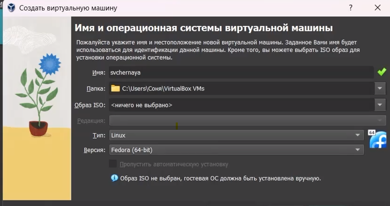{#fig:002 width=70%}

## Создание виртуальной машины

Указываю объем основной памяти виртуальной машины, размером 4096 МБ(рис. 2)

{#fig:003 width=70%}

## Создание виртуальной машины

Выбираю создание нового виртуального диска и указываю его размер(рис. 3)

{#fig:004 width=70%}

## Создание виртуальной машины

Выбираю в VirtualBox настройку своей виртуальной машины, перехожу в "носители", добавляю новый привод оптических дисков и выбираю скаченный образ операционной системы Fedora(рис. 4)

{#fig:005 width=70%}

## Создание виртуальной машины

Скачанный образ ОС был успешно выбран(рис. 5)

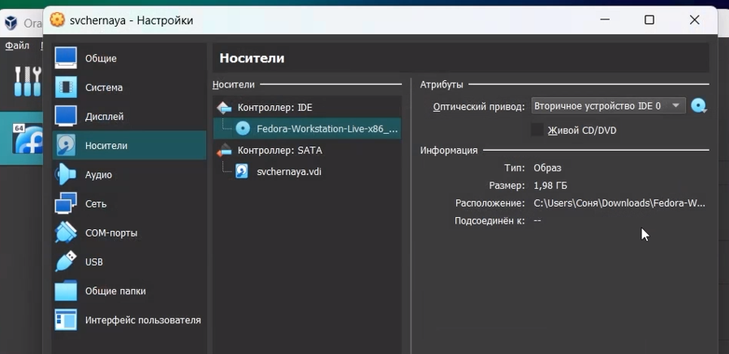{#fig:006 width=70%}

## Установка операционной системы

Запускаю созданную виртуальную машину для установки(рис. 6)

{#fig:007 width=70%}

## Установка операционной системы

Выбираю язык для дальнейшего использования в процессе установки(рис. 7)

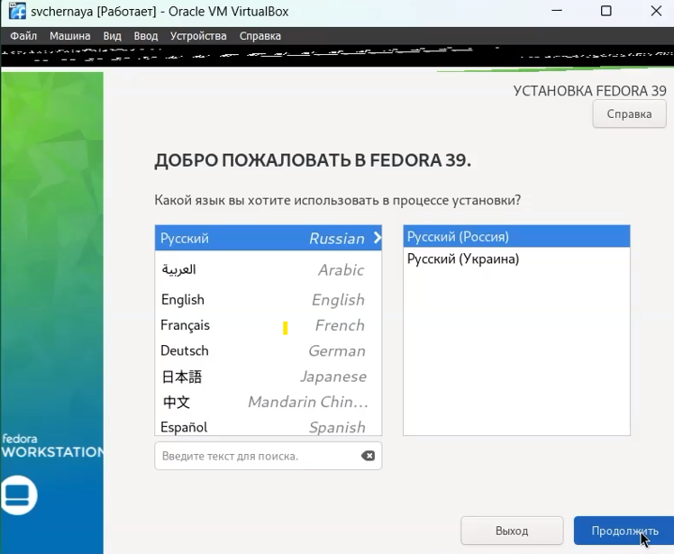{#fig:008 width=70%}

## Установка операционной системы

Раскладку клавиатуры оставляю по умолчанию(английская и русская), дату и время так же оставляю по умолчанию(Европа/Москва). Выбираю место установки(рис. 8)

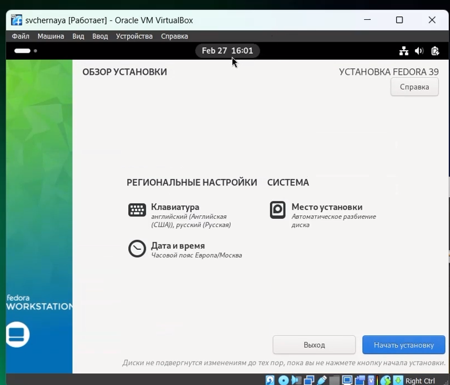{#fig:009 width=70%}

## Установка операционной системы

Далее операционная система устанавливается. После установки нажимаю "завершить установку"(рис. 9)

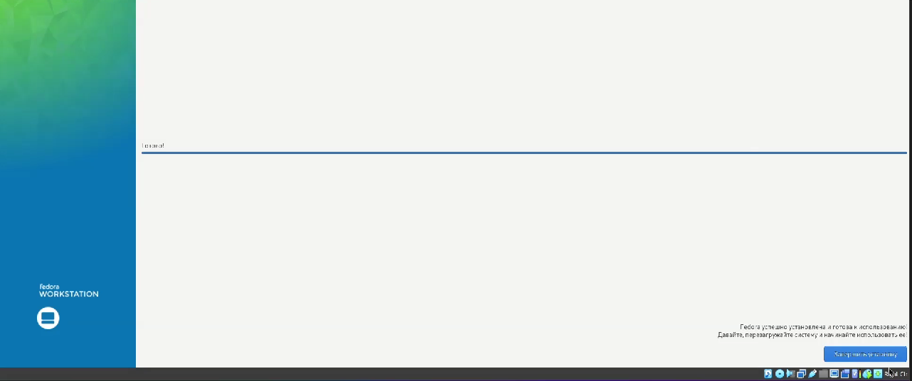{#fig:010 width=70%}

## Установка операционной системы

Диск не отключался автоматически, поэтому отключаю носитель информации с образом(рис. 10)

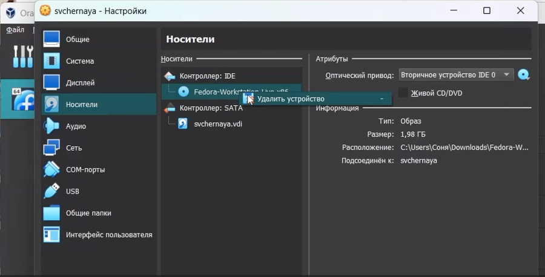{#fig:012 width=70%}

## Установка операционной системы

Загружаю виртуальную машину и задаю имя пользователя(рис. 11)

{#fig:013 width=70%}

## Установка операционной системы

Устанавливаю пароль пользователя (рис. 12)

{#fig:014 width=70%}

## Работа с операционной системой после установки

Захожу в терминал и переключаюсь на роль супер-пользователя(рис. 13)

{#fig:015 width=70%}

## Работа с операционной системой после установки

Обновляю все пакеты(рис. 14)

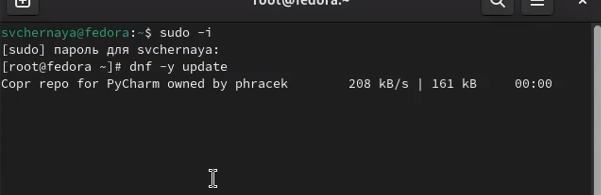{#fig:016 width=70%}

## Работа с операционной системой после установки

Устанавливаю программы для удобства работы в консоли(рис. 15)

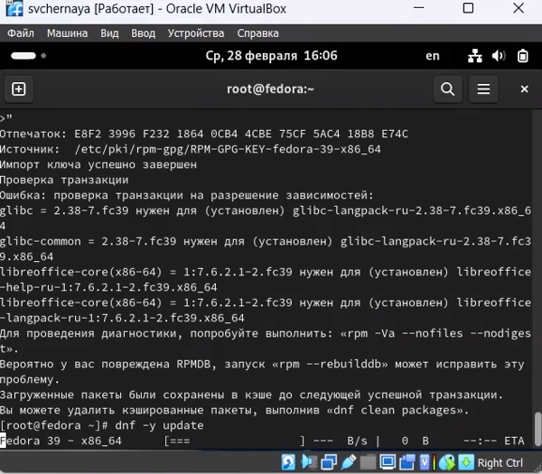{#fig:017 width=70%}

## Работа с операционной системой после установки

Устанавливаю программы для автоматического обновления(рис. 16)

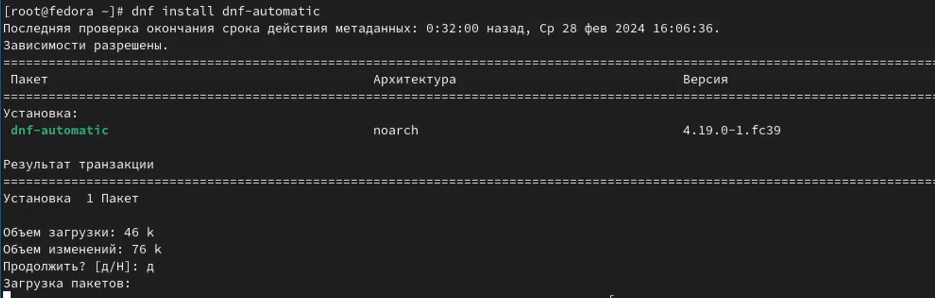{#fig:018 width=70%}

## Работа с операционной системой после установки

Перемещаюсь в директорию /etc/selinux, открываю md, ищу нужный файл (рис. 17)

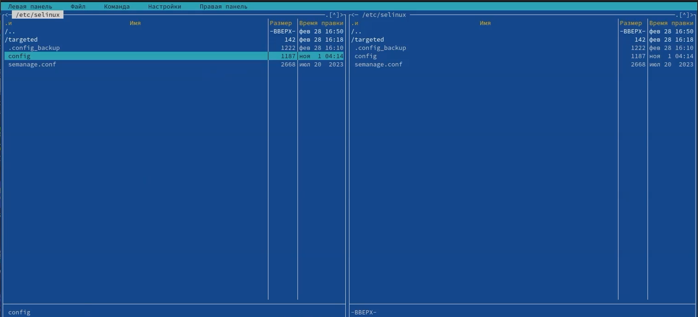{#fig:019 width=70%}

## Работа с операционной системой после установки

Изменяю открытый файл: SELINUX=enforcing меняю на значение SELINUX=permissive(рис. 18)

{#fig:020 width=70%}

## Работа с операционной системой после установки

Перезагружаю машину, захожу снова в ОС, запускаю терминал, запускаю терминальный мультиплексор tmux. Переключаюсь на роль супер-пользователя и устанавливаю средства разработки(рис. 19)

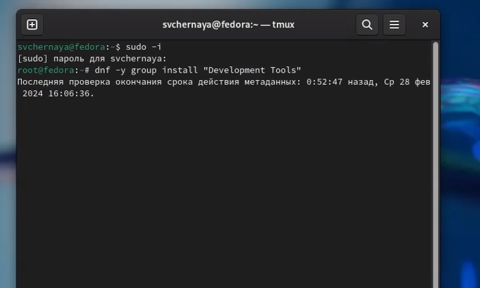{#fig:021 width=70%}

## Установка программного обеспечения для создания документации

Устанавливаю дистрибутив texlive(рис. 20)

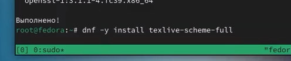{#fig:022 width=70%}

## Установка программного обеспечения для создания документации

Устанавливаю необходимые расширения для pandoc (рис. 21)

{#fig:023 width=70%}

## Выводы

При выполнении данной лабораторной работы я приобрела практические навыки установки операционной системы на виртуальную машину, а так же сделала настройки минимально необходимых для дальнейшей работы сервисов.

## Выполнение дополнительного задания

Ввожу в терминале команду dmesg, чтобы проанализировать последовательность загрузки системы (рис. 22).

{#fig:024 width=70%}

## Выполнение дополнительного задания

С помощью поиска, осуществляемого командой 'dmesg | grep -i <что ищем>', ищу версию ядра Linux: 6.1.10-200.fc37.x86_64 (рис. 23).

{#fig:026 width=70%}

## Выполнение дополнительного задания

К сожалению, если вводить "Detected Mhz processor" там, где нужно указывать, что я ищу, то мне ничего не выведется. Это происходит потому, что запрос не предусматривает дополнительные символы внутри него (я проверяла, будет ли работать он с маской - не будет). В таком случае я оставила одно из ключевых слов (могла оставить два: "Mhz processor") и получаю результат (рис. 24).

{#fig:030 width=70%}

## Выполнение дополнительного задания

Аналогично ищу модель процессора (рис. 25).

{#fig:031 width=70%}

## Выполнение дополнительного задания

Объем доступной оперативной памяти ищу аналогично поиску частоты процессора, т. к. возникла та же проблема, что и там (рис. 26).

{#fig:027 width=70%}

## Выполнение дополнительного задания

Нахожу тип обнаруженного гипервизора (рис. 27).

{#fig:028 width=70%}

## Выполнение дополнительного задания

Последовательность монтирования файловых систем можно посмотреть, введя в поиск по результату dmesg слово mount (рис. 28).

{#fig:029 width=70%}

# Список литературы{.unnumbered}
::: {#fefs}

1. https://esystem.rudn.ru/mod/page/view.php?id=1098787
