---
## Front matter
lang: ru-RU
title: Лабораторная работа №2
subtitle: Операционные системы
author:
  - Черная С.В.
institute:
  - Российский университет дружбы народов, Москва, Россия
date: 02 марта 2024

## i18n babel
babel-lang: russian
babel-otherlangs: english

## Formatting pdf
toc: false
toc-title: Содержание
slide_level: 2
aspectratio: 169
section-titles: true
theme: metropolis
header-includes:
 - \metroset{progressbar=frametitle,sectionpage=progressbar,numbering=fraction}
 - '\makeatletter'
 - '\beamer@ignorenonframefalse'
 - '\makeatother'
---

## Цель работы

Целью данной лабораторной работы - изучение идеологии и применения средств контроля версий, освоение умений по работе с git.

## Задание

1. Создать базовую конфигурацию для работы с git 
2. Создать ключ SSH
3. Создать ключ GPG
4. Настроить подписи Git
5. Зарегестрироваться на GitHub
6. Создать локальный каталон для выволнения заданий по предмет

## Выполнение лабораторной работы. Установка программного обеспечения

Устанавливаю необходимое программное обеспечение git через терминал(рис. 1).

{#fig:001 width=70%}

## Установка программного обеспечения

Устанавливаю необходимое программное обеспечение gh через терминал(рис. 2).

{#fig:002 width=70%}

## Базовая настройка git

Задаю в качестве имени и email владельца репозитория свои имя, фамилию и электронную почту (рис. 3).

{#fig:003 width=70%}

## Базовая настройка git

Настраиваю utf-8 в выводе сообщений git для их корректного отображения (рис. 4).

{#fig:004 width=70%}

## Базовая настройка git

Начальной ветке задаю имя master (рис. 5).

{#fig:005 width=70%}

## Базовая настройка git

Задаю параметры autoctlf и safecrlf для корректного отображения конца строки(рис. 6).

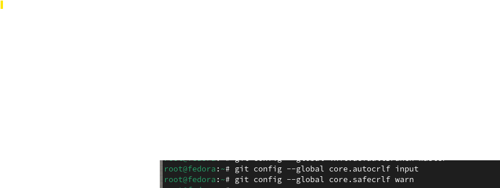{#fig:006 width=70%}

## Создание ключа SSH

Создаю ключ ssh размером 4096 бит по алгоритму rsa(рис. 7).

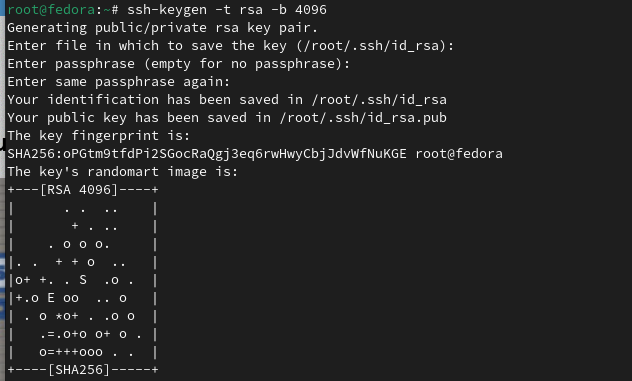{#fig:007 width=70%}

## Создание ключа SSH

Создаю ключ ssh по алгоритму ed25519(рис. 8).

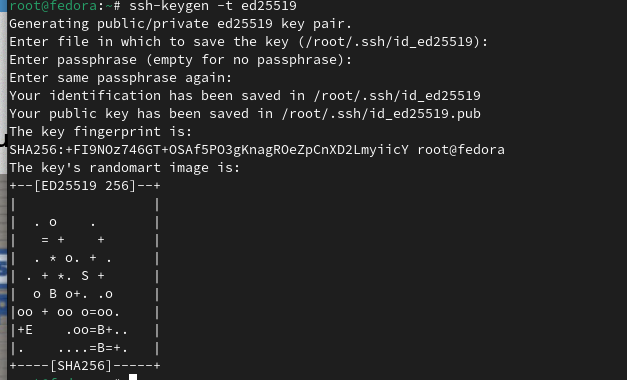{#fig:008 width=70%}

## Создание ключа GPG

Генерирую ключ GPG, затем выбираю тип ключа RSA или RSA, задаю максимальную длину ключа: 4096, оставляю неограниченный срок действия ключа. Далее отвечаю на вопросы программы о личной информации(рис. 9).

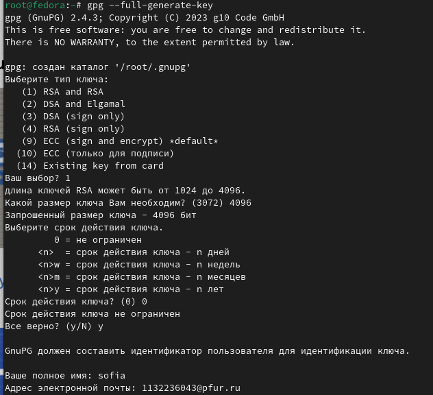{#fig:009 width=70%}

## Регистрация на Github

У меня уже был создан аккаунт на Github, соответственно, основные данные аккаунта я так же заполняла и проводила его настройку, поэтому просто вхожу в свой аккаунт(рис. 10).

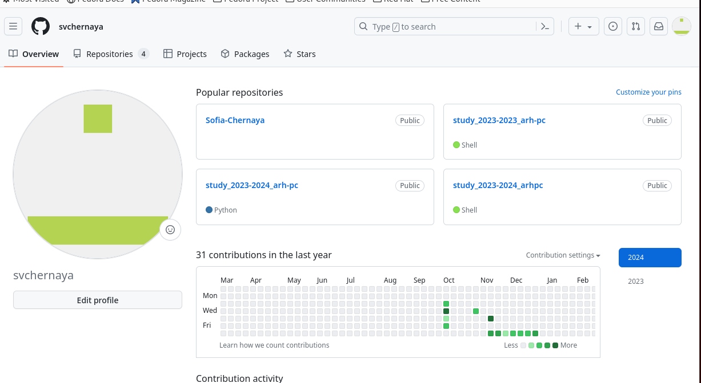{#fig:010 width=70%}

## Добавление ключа GPG в Github

Вывожу список созданных ключей в терминал, ищу в результате запроса отпечаток ключа ( последовательность байтов для идентификации более длинного, по сравнению с самим отпечатком, ключа), он стоит после знака слеша, копирую его в буфер обмена(рис. 13).

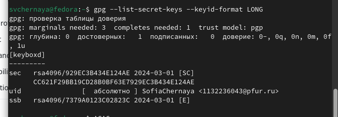{#fig:013 width=70%}

## Добавление ключа GPG в Github

Ввожу в терминале команду, с помощью которой копирую сам ключ PGP в буфер обмена, за это отвечает утилита xclip(рис. 14).

{#fig:014 width=70%}

## Добавление ключа GPG в Github

Открываю настройки Github, ищу среди них добавление PGP ключа(рис. 15).

{#fig:015 width=70%}

## Добавление ключа GPG в Github

Нажимаю на "New GPG key" и вставляю в поле ключ из буфера обмена(рис. 16).

{#fig:016 width=70%}

## Добавление ключа GPG в Github

Я добавила ключ GPG на GitHub(рис. 17).

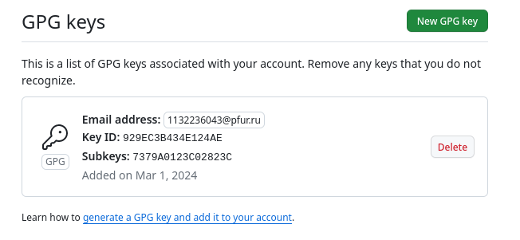{#fig:017 width=70%}

## Настройка подписи Git

Настраиваю автоматические подписи коммитов git: используя введенный ранее email, указываю git использовать его при создании подписей коммитов(рис. 18).

{#fig:018 width=70%}

## Настройка gh

Начинаю авторизацию в gh, отвечаю на наводящие вопросы от утилиты, в конце выбираю авторизоваться через браузер(рис. 19).

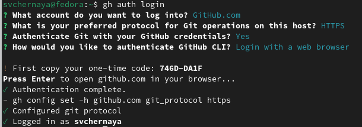{#fig:025 width=70%}

## Настройка gh

Завершаю авторизацию на сайте(рис. 20).

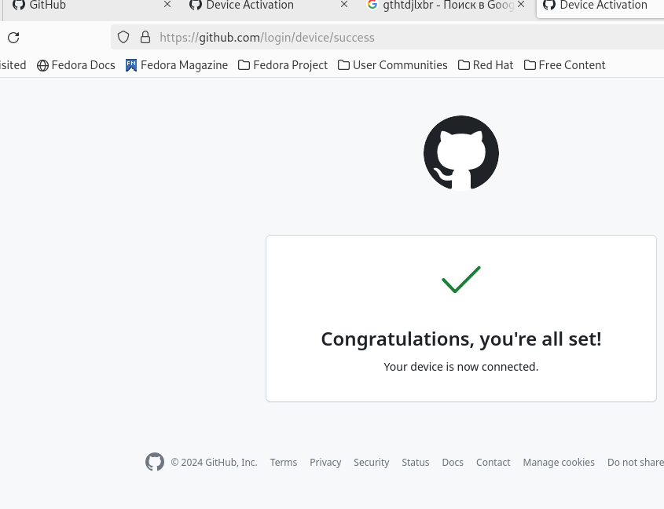{#fig:019 width=70%}

## Создание репозитория курса на основе шаблона

Сначала создаю директорию с помощью утилиты mkdir и флага -p, который позволяет установить каталоги на всем указанном пути. После этого с помощью утилиты сd перехожу в только что созданную директорию "Операционные системы". Далее в терминале ввожу комануд gh repo create study_2022-2023_os-intro --template yamadharma/course-directory-student-trmplate --publiс, чтобы создать репозиторий на основе шаблона репозитория. После этого клонирую репозиторий к себе в директорию, я указываю ссылку с протоколом https, а не ssh, потому что при авторизации в gh выбрала протокол https(рис. 20).

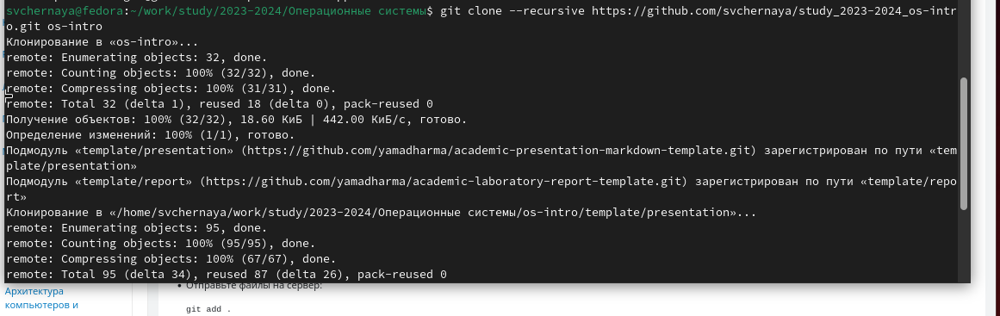{#fig:021 width=70%}

## Создание репозитория курса на основе шаблона

Перехожу в каталог курса с помощью утилиты cd, проверяю содержание каталога с помощью утилиты ls(рис. 21).

{#fig:022 width=70%}

## Создание репозитория курса на основе шаблона

Удаляю лишние файлы с помощью утилиты rm, далее создаю необходимые каталоги используя makefile (рис. 22).

{#fig:023 width=70%}

## Создание репозитория курса на основе шаблона

Добавляю все новые файлы для отправки на сервер (сохраняю добавленные изменения) с помощью команды git add и комментирую их с помощью git commit. Отправляю файлы на сервер с помощью git push (рис. 23).

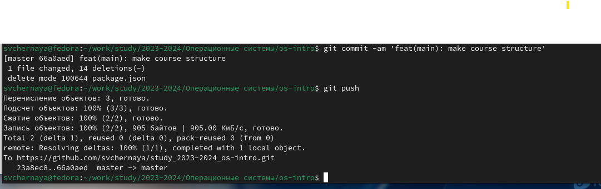{#fig:024 width=70%}

# Выводы

При выполнении данной лабораторной работы я изучила идеологию и применение средств контроля версий, освоила умение по работе с git.

# Список литературы{.unnumbered}

https://esystem.rudn.ru/mod/page/view.php?id=1098790
