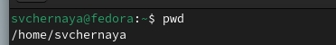
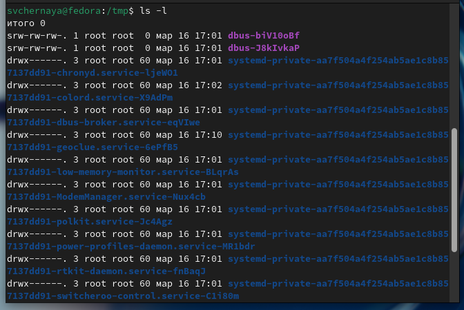
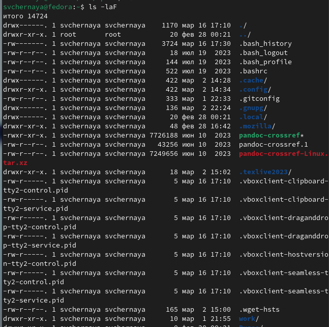
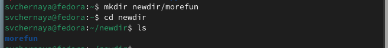
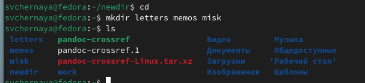
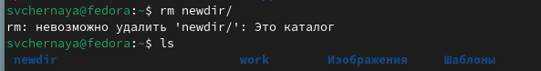
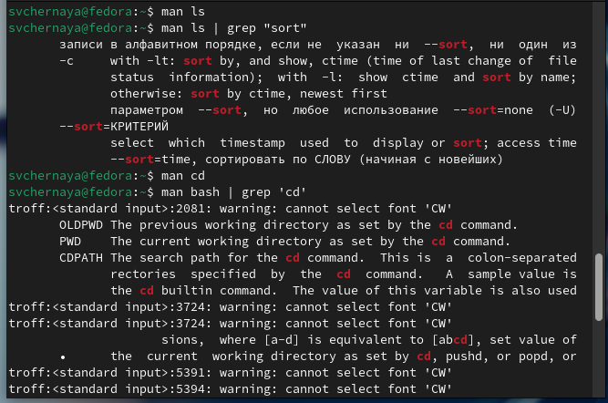
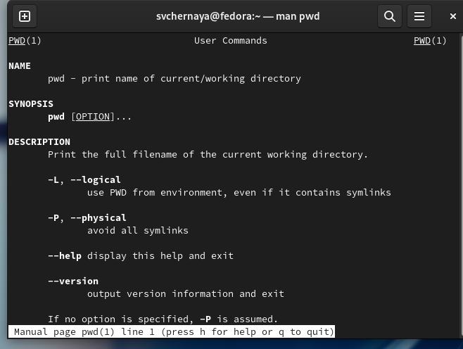
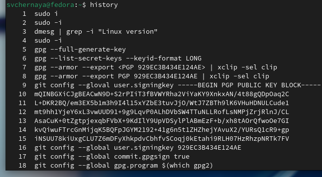

---
## Front matter
lang: ru-RU
title: Лабораторная работа №6
subtitle: Операционные системы
author:
  - Черная С.Вю
institute:
  - Российский университет дружбы народов, Москва, Россия
date: 16 марта 2024

## i18n babel
babel-lang: russian
babel-otherlangs: english

## Formatting pdf
toc: false
toc-title: Содержание
slide_level: 2
aspectratio: 169
section-titles: true
theme: metropolis
header-includes:
 - \metroset{progressbar=frametitle,sectionpage=progressbar,numbering=fraction}
 - '\makeatletter'
 - '\beamer@ignorenonframefalse'
 - '\makeatother'
---

# Информация

## Цель лабораторной работы

Приобретение практических навыков взаимодействия пользователя с системой посредством командой строки.

## Теоретическое введение

В операционной системе типа Linux взаимодействие пользователя с системой обычно
осуществляется с помощью командной строки посредством построчного ввода команд. При этом обычно используется командные интерпретаторы языка shell: /bin/sh;
/bin/csh; /bin/ksh.

Командой в операционной системе называется записанный по
специальным правилам текст (возможно с аргументами), представляющий собой указание на выполнение какой-либо функций (или действий) в операционной системе.
Обычно первым словом идёт имя команды, остальной текст — аргументы или опции,
конкретизирующие действие.

Общий формат команд можно представить следующим образом:
<имя_команды><разделитель><аргументы>
Команда man. Команда man используется для просмотра (оперативная помощь) в диалоговом режиме руководства (manual) по основным командам операционной системы
типа Linux.

Формат команды:
man <команда>

Файловая система ОС типа Linux — иерархическая система каталогов,
подкаталогов и файлов, которые обычно организованы и сгруппированы по функциональному признаку. Самый верхний каталог в иерархии называется корневым
и обозначается символом /. Корневой каталог содержит системные файлы и другие
каталоги.

В работе с командами, в качестве аргументов которых
выступает путь к какому-либо каталогу или файлу, можно использовать сокращённую
запись пути.

# Выполнение лабораторной работы

## Узнать полное имя домашнего каталога

Полное имя домашнего каталога можно узнать с помощью утилиты pwd(рис. 1).

{#fig:001 width=70%}
 
## Перемещение между директориями 

С помощью утилиты cd перехожу в подкаталог tmp корневого каталога(рис. 2).

{#fig:002 width=70%}

## Просмотр содержимого каталога

С помощью утилиты ls, пока без ключей, просматриваю содержимое каталога tmp(рис. 3).

## Просмотр содержимого каталога

{#fig:003 width=70%}

Пробую использовать команду ls с разными опциями. Опция -l позволит увидеть дополнительную информацию о файлах в каталоге : время создания, владельца, права(рис. 4).

## Просмотр содержимого каталога

{#fig:004 width=70%}

## Просмотр содержимого каталога

Опция -а покажет скрытые файлы в каталоге(рис. 5).

{#fig:005 width=70%}

## Поиск файла в директории

Перехожу в каталог /var/spool/ с помощью cd.Чтобы определить, есть ли в каталоге подкатлог с соответствующим именем, на самом деле, достаточно начать вводить какую-нибудь команду и имя файла и воспользоваться подсказкой tab, многие окружения рабочего стола обозначают файлы и каталоги разными цветами. Но на всякий случай воспользуемся утилитой ls с флагом -F, чтобы проверить, что мы найдем именно каталог. И да, в директории действительно есть такой каталог (рис. 6).

{#fig:006 width=70%}

## Изучение файлов директории

Возвращаюсь в домашний каталог, для этого достаточно ввести команду cd. Затем проверяю содержимое каталога с помощью утилиты ls, опция -l позволяет определить владельцев файлов, опция -a показывает все содержимое каталога, -F поможет определить что из содержимого каталога файл, а что каталог (рис. 7).

{#fig:007 width=70%}

## Создание директорий

Создаю директорию newdir с помощью утилиты mkdir, затем проверяю, что директория создалась с помощью ls (рис. 8).

{#fig:008 width=70%}

Создаю для каталога newdir подкаталог morefun, проверяю, что каталог собран (рис. 9).

{#fig:009 width=70%}

## Создание и удаление директорий

Чтобы создать несколько директорий одной строчкой нужно перечислить назваания директорий через пробел после утилиты mkdir (рис. 10). Проверяю, что все файлы созданы.

{#fig:010 width=70%}

Чтобы удалить несколько **пустых** директорий одной строчкой нужно перечислить назваания директорий через пробел после утилиты rmdir (рис. 11). Проверяю, что все файлы удалены.

{#fig:011 width=70%}

## Удаление директорий

Пытаюсь удалить newdir с помощью rm. Утилита rm по умолчанию удаляет файлы, чтобы она удалила пустую директорию нужно добавить опцию -d, но newdir не пустая дериктория, поэтому нужно добавить опцию для рекурсивного удаления -r. Использовалась утилиты без опций, поэтому каталог не был удален (рис. 12).

{#fig:012 width=70%}

Удаляю директорию newdir с помощью утилиты rmdir, т.к директория не пустая, я добавляю флаг удалить рекурсивно -p, чтобы удалилсь и все подкаталоги (рис. 13).

{#fig:013 width=70%}

## Опции ls

С помощью команды man ls я могу прочесть документацию к команде ls(рис. 14).

{#fig:014 width=70%}

{#fig:015 width=70%}

## cd

С помощью man cd узнаю описание команды cd и ее опции. Основных опций немного (рис. 16).
1. -P - позволяет следовать по символическим ссылкам перед тем, как обработаны все переходы '..'
3. -L - переходит по символическим ссылкам только после того, как обработаны все переходы ".."
4. -e - позволяет выйти с ошибкой, если диреткория, в которую нужно перейти, не найдена.

{#fig:016 width=70%}

## pwd 

С помощью man pwd узнаю описание команды pwd и ее опции (рис. 17).
1. -L - брать директорию из переменной окружения, даже если она содержит символические ссылки.
2. -P - отбрасывать все символические ссылки.

{#fig:017 width=70%}

## mkdir

С помощью man mkdir узнаю описание команды mkdir и ее опции (рис. 18).
1. -m - устанавливает права доступа создаваемой директории как chmod, синтаксис тоже как у chmod.
2. -p - позволяет рекурсивно создавать директории и их подкаталоги
3. -v - выводи сообщение о созданных директориях
4. -z - установить контекст SELinux для создаваемой директории по умолчанию
5. -context - установить контекст SELinux для создаваемой директории в значении CTX

{#fig:018 width=70%}

## rmdir

С помощью man rmdir узнаю описание команды rmdir и ее опции (рис. 19).
1. --ignore-fail-on-non-empty - отменяет вывод ошибки, если каталог не пустой, просто его игнорирует
2. -p - удаляет рекурсивно каталоги, если они все содержат в себе только удаляемый каталог
3. -v - выводит сообщение о каждом удалении  директории.

{#fig:019 width=70%}

## rm

С помощью man rm узнаю описание команды rm и ее опции (рис. 20).
1. -f - игнорировать несуществующие файлы или аргументы, никогда не выводить запрос на подтверждение удаления
2. -i - выводить запрос на подтверждение удаления каждого файла
3. -I - вывести запрос на подтверждение удаления один раз, для всех файлов, если удаляется больше 3-х файлов или идет рекурсивное удаление
4. --interactive - заменяет предыдущие три опции, можно выбрать одну из них.
5. --one-file-system - во время рекурсивного удаления пропускать директории из других файловых систем
6. --no-preserve-root если в качестве директории задана корневая, то считать что это обычная директория и начать удаление.
7. -r, -R - удаляет директории их содержимое рекурсивно
8. -d, --dir - удаляет пустые директории
9. -v - прописывает все действия команды

{#fig:020 width=70%}

## Примечание

Вывела историю команд с помощью утилиты history(рис. 21).

{#fig:021 width=70%}

# Выводы

Я приобрела практические навыки взаимодействия пользователя с системой посредством командной строки.

